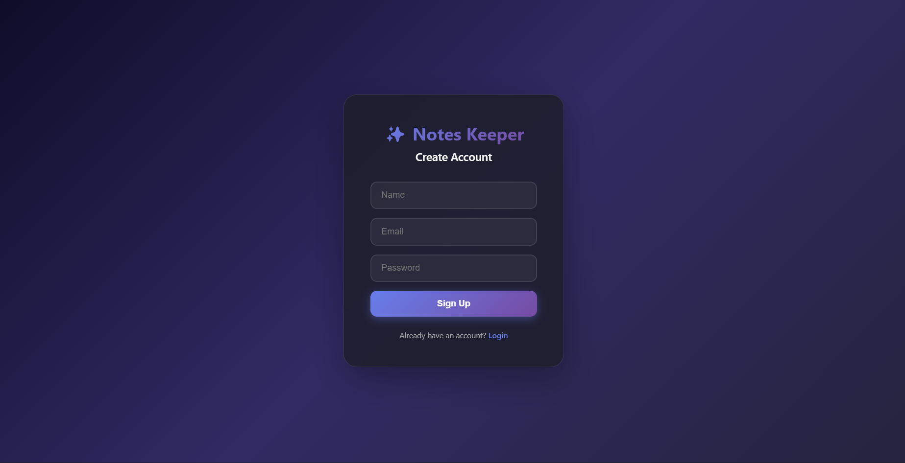
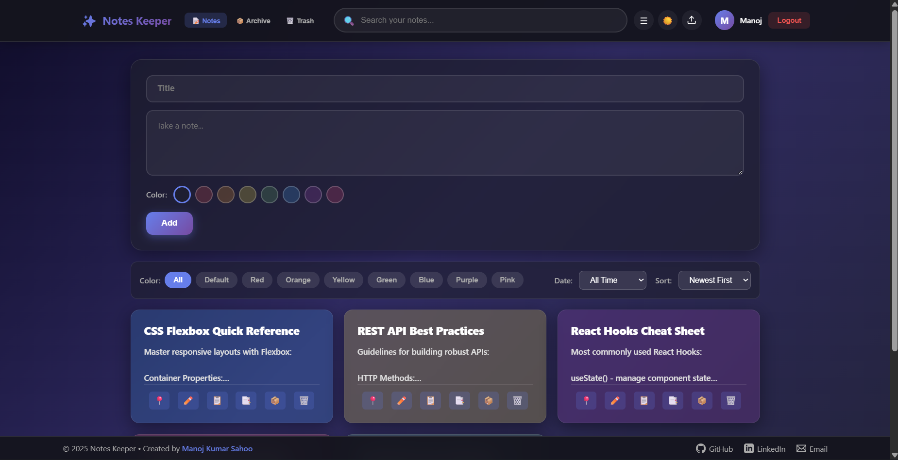
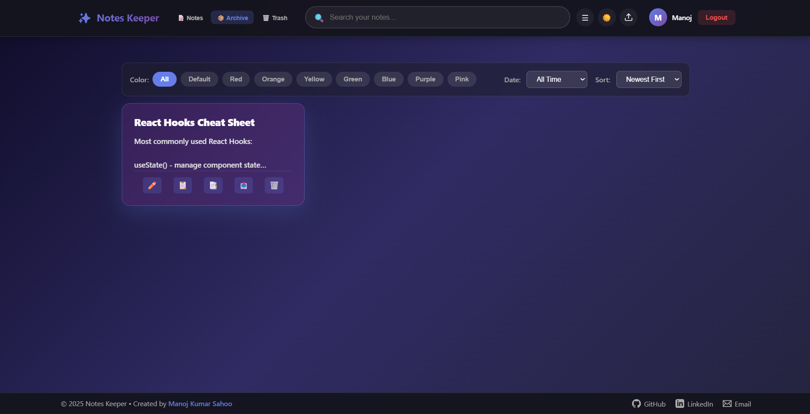
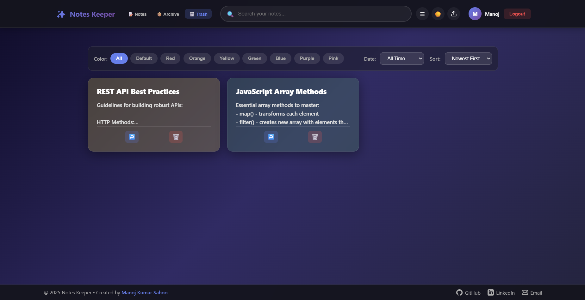
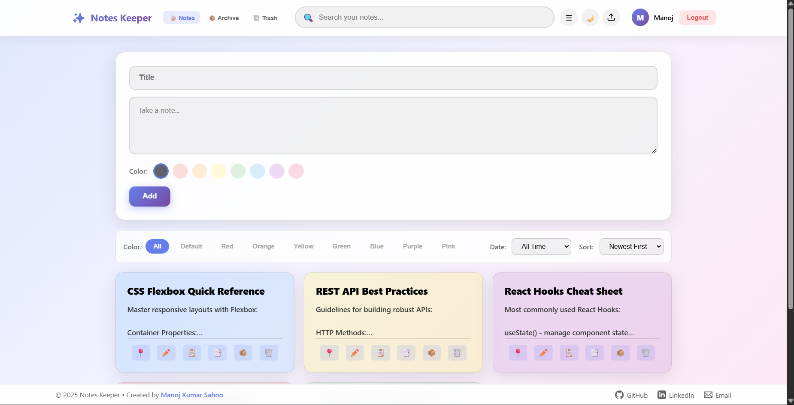
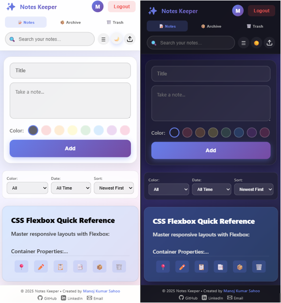

# 📝 Notes Keeper

<div align="center">


A modern, full-stack note-taking application built with the MERN stack, featuring user authentication, real-time search, and an intuitive Google Keep-inspired interface.

[](https://mks-notes-keeper.vercel.app/)
[](LICENSE)
[](https://nodejs.org)
[](https://reactjs.org)

[Features](#-features) • [Demo](#-demo) • [Installation](#-installation) • [Usage](#-usage) • [Documentation](DOCUMENTATION.md) • [Tech Stack](#-tech-stack)

</div>

---

## 🌟 Features

### Core Functionality
- **🔐 Secure Authentication** - JWT-based user registration and login system
- **✍️ CRUD Operations** - Create, read, update, and delete notes seamlessly
- **🔍 Real-time Search** - Instantly search notes by title or content
- **📌 Pin Notes** - Keep important notes at the top
- **🗂️ Archive & Trash** - Organize and manage notes efficiently
- **🎨 Theme Toggle** - Switch between dark and light modes
- **📱 Responsive Design** - Works flawlessly on desktop, tablet, and mobile

### User Experience
- Clean, intuitive Google Keep-inspired UI
- Smooth animations and transitions
- Real-time updates without page refresh
- Persistent user sessions
- Toast notifications for user actions

---

## 🎯 Demo

### Live Application
🔗 **[View Live Demo](https://mks-notes-keeper.vercel.app/)**

### Screenshots

<div align="center">

| Login Page | Dashboard |
|------------|-----------|
|  |  |

| Archive | Trash |
|-------------|-----------------|
|  |  |

| White Mode | Mobile View |
|-------------|-----------------|
|  |  |

</div>

---

## 🚀 Installation

### Prerequisites
- Node.js (v18.0.0 or higher)
- MongoDB (local or Atlas)
- npm or yarn package manager

### Clone Repository
```bash
git clone https://github.com/manoj-sahoo-536/NoteKeeper.git
cd NoteKeeper
```

### Backend Setup
```bash
cd Notepad/backend
npm install

# Create .env file
cat > .env << EOF
PORT=5000
MONGODB_URI=mongodb://localhost:27017/noteskeeper
JWT_SECRET=your_super_secret_jwt_key_here
NODE_ENV=development
EOF

# Start backend server
npm run dev
```

### Frontend Setup
```bash
cd Notepad/frontend
npm install

# Create .env file (if needed)
echo "REACT_APP_API_URL=http://localhost:5000" > .env

# Start frontend
npm start
```

The application will open at `http://localhost:3000`

---

## 📖 Usage

> 📚 **For detailed technical documentation, architecture, and implementation details, see [DOCUMENTATION.md](DOCUMENTATION.md)**

### Getting Started
1. **Sign Up** - Create a new account with your name, email, and password
2. **Login** - Access your personal notes dashboard
3. **Create Notes** - Click the "+" button to add a new note
4. **Edit Notes** - Click on any note to edit its content
5. **Search** - Use the search bar to find notes instantly
6. **Pin Notes** - Click the pin icon to keep important notes at the top
7. **Archive/Delete** - Manage your notes with archive and trash options

### Keyboard Shortcuts
- `Ctrl/Cmd + K` - Focus search bar
- `Ctrl/Cmd + N` - Create new note
- `Esc` - Close note editor

---

## 🛠️ Tech Stack

### Frontend
- **React** (18.2.0) - UI library
- **Axios** - HTTP client for API requests
- **Marked** - Markdown parsing
- **CSS3** - Styling with modern features

### Backend
- **Node.js** - Runtime environment
- **Express.js** (4.18.2) - Web framework
- **MongoDB** - NoSQL database
- **Mongoose** (7.5.0) - ODM for MongoDB

### Security & Authentication
- **JWT** (jsonwebtoken 9.0.2) - Token-based authentication
- **bcryptjs** (2.4.3) - Password hashing
- **CORS** - Cross-origin resource sharing

### Development Tools
- **Nodemon** - Auto-restart server
- **dotenv** - Environment variable management

---

## 📡 API Documentation

### Base URL
```
http://localhost:5000/api
```

### Authentication Endpoints

#### Register User
```http
POST /auth/signup
Content-Type: application/json

{
  "name": "John Doe",
  "email": "john@example.com",
  "password": "securePassword123"
}
```

#### Login User
```http
POST /auth/login
Content-Type: application/json

{
  "email": "john@example.com",
  "password": "securePassword123"
}
```

**Response:**
```json
{
  "token": "eyJhbGciOiJIUzI1NiIsInR5cCI6IkpXVCJ9...",
  "user": {
    "id": "user_id",
    "name": "John Doe",
    "email": "john@example.com"
  }
}
```

### Notes Endpoints (Protected)

> **Note:** All notes endpoints require JWT token in Authorization header:
> ```
> Authorization: Bearer <your_jwt_token>
> ```

#### Get All Notes
```http
GET /notes?search=keyword
```

#### Create Note
```http
POST /notes
Content-Type: application/json

{
  "title": "My Note",
  "content": "Note content here",
  "isPinned": false
}
```

#### Update Note
```http
PUT /notes/:id
Content-Type: application/json

{
  "title": "Updated Title",
  "content": "Updated content",
  "isPinned": true
}
```

#### Delete Note
```http
DELETE /notes/:id
```

---

## 📁 Project Structure

```
notes-keeper/
├── Notepad/
│   ├── backend/
│   │   ├── middleware/
│   │   │   └── auth.js           # JWT authentication middleware
│   │   ├── models/
│   │   │   ├── User.js           # User schema
│   │   │   └── Note.js           # Note schema
│   │   ├── routes/
│   │   │   ├── auth.js           # Authentication routes
│   │   │   └── notes.js          # Notes CRUD routes
│   │   ├── .env                  # Environment variables
│   │   ├── server.js             # Express server entry point
│   │   └── package.json
│   │
│   └── frontend/
│       ├── public/
│       │   └── index.html
│       ├── src/
│       │   ├── App.js            # Main application component
│       │   ├── Footer.js         # Footer component
│       │   ├── index.js          # React entry point
│       │   └── index.css         # Global styles
│       ├── package.json
│       └── .env.example
│
├── README.md
└── .gitignore
```

---

## 🔒 Environment Variables

### Backend (.env)
```env
PORT=5000
MONGODB_URI=mongodb://localhost:27017/noteskeeper
JWT_SECRET=your_super_secret_jwt_key_change_this_in_production
NODE_ENV=development
```

### Frontend (.env)
```env
REACT_APP_API_URL=http://localhost:5000
```

---

## 🚢 Deployment

### Backend Deployment (Render/Railway/Heroku)
1. Push code to GitHub
2. Connect repository to hosting platform
3. Set environment variables
4. Deploy

### Frontend Deployment (Vercel/Netlify)
1. Build the production version: `npm run build`
2. Deploy the `build` folder
3. Set environment variable: `REACT_APP_API_URL=<your_backend_url>`

### MongoDB Atlas Setup
1. Create a free cluster at [MongoDB Atlas](https://www.mongodb.com/cloud/atlas)
2. Get connection string
3. Update `MONGODB_URI` in backend .env

---

## 🤝 Contributing

Contributions are welcome! Please follow these steps:

1. Fork the repository
2. Create a feature branch (`git checkout -b feature/AmazingFeature`)
3. Commit your changes (`git commit -m 'Add some AmazingFeature'`)
4. Push to the branch (`git push origin feature/AmazingFeature`)
5. Open a Pull Request

---

## 🐛 Known Issues & Future Enhancements

### Known Issues
- None currently reported

### Planned Features
- [ ] Rich text editor with formatting options
- [ ] Note sharing and collaboration
- [ ] Tags and categories
- [ ] Export notes (PDF, Markdown)
- [ ] Reminders and notifications
- [ ] Drag-and-drop note organization
- [ ] Image attachments
- [ ] Voice notes

---

## 📝 License

This project is licensed under the MIT License - see the [LICENSE](LICENSE) file for details.

---

## 👨‍💻 Author

**Manoj Kumar Sahoo**

- GitHub: [@manoj-sahoo-536](https://github.com/manoj-sahoo-536)
- LinkedIn: [manoj-kumar-sahoo-mks](https://linkedin.com/in/manoj-kumar-sahoo-mks)
- Email: manojsahoo8940@gmail.com

---

## 🙏 Acknowledgments

- Inspired by Google Keep
- Built with passion for productivity tools
- Thanks to the open-source community

---

<div align="center">

### ⭐ Star this repository if you find it helpful!

Made with ❤️ by [Manoj Kumar Sahoo](https://github.com/manoj-sahoo-536)

</div>
